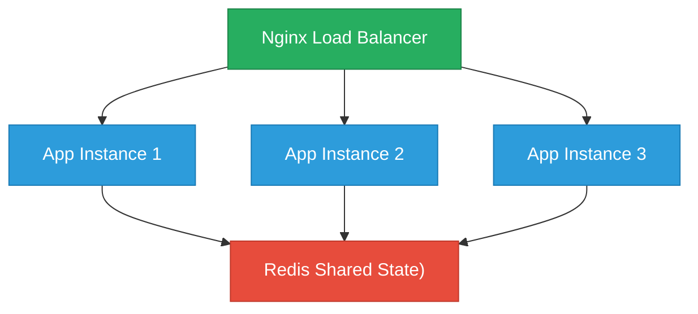

# Stock Market Service

[](https://github.com/szymoniwaniuk/stock-market-go/actions/workflows/ci.yml)

A simplified stock market REST API built in Go with Redis as a shared state store. Wallets can buy and sell stocks from a central Bank, with all successful operations recorded in an audit log.

## Table of Contents
- [About the Project](#about-the-project)
- [Architecture](#architecture)
- [Getting Started](#getting-started)
- [Usage](#usage)
- [Exposed Endpoints](#exposed-endpoints)
- [Running Tests](#running-tests)
- [Technical Details](#technical-details)
- [Project Structure](#project-structure)

## About the Project
Stock Market Service simulates a simplified stock exchange. This service provides:
- **Wallet Management**: Buy and sell stocks from a central bank with atomic operations
- **High Availability**: 3 app instances behind Nginx - killing one doesn't take down the service
- **Audit Logging**: All successful wallet operations are recorded in order of occurrence
- **Cross-Platform**: Single startup command works on Windows, Linux, and macOS (x64 and arm64)

## Architecture

The service runs as 3 identical Go instances behind an Nginx reverse proxy, with shared state in Redis. Docker Compose `restart: always` automatically recovers killed instances.



Trade operations are atomic via Redis Lua scripts, preventing race conditions across instances. Nginx `proxy_next_upstream` automatically retries requests on another instance if one is down.

## Getting Started
### Prerequisites
- **Go** runtime (latest version)
- **Docker** and Docker Compose — follow [this guide](https://docs.docker.com/get-docker/) to install

### Warning: Port Availability

Before running this application, ensure that the port you intend to use is not occupied by another process.

#### On Linux/macOS:
```sh
lsof -i :<PORT>
```
#### On Windows (PowerShell):
```sh
netstat -ano | findstr :<PORT>
```

## Usage

### 1. Clone the repo
```sh
git clone https://github.com/szymoniwaniuk/stock-market-go.git
cd stock-market-go
```

### 2. Deploy the application

Cross-platform deployment scripts handle building, starting, and health-checking the service:

#### Linux / macOS
```sh
./scripts/deploy.sh 8080
```

#### Windows (PowerShell)
```powershell
.\scripts\deploy.ps1 -Port 8080
```

#### Windows (CMD)
```cmd
scripts\deploy.bat 8080
```

#### Using Make
```sh
make up PORT=8080
```

The service will be available at `http://localhost:8080`.

### 3. Stopping the application
```sh
make down
```

### 4. Other Make targets
```sh
make build       # build Docker images
make restart     # full restart (down + up)
make logs        # follow container logs
make health      # quick health check
make lint        # run golangci-lint
make test        # run unit tests
make e2e-test    # run end-to-end tests
make clean       # stop containers and remove images
```

## Exposed Endpoints

### 1. Set bank stock inventory

#### **POST** `/stocks`

Sets the state of the bank. Returns 200 on success.

Request body:
```json
{
  "stocks": [
    {"name": "AAPL", "quantity": 10},
    {"name": "GOOG", "quantity": 5}
  ]
}
```

```sh
curl -X POST http://localhost:8080/stocks \
  -d '{"stocks":[{"name":"AAPL","quantity":10},{"name":"GOOG","quantity":5}]}'
```

### 2. Get current bank state

#### **GET** `/stocks`

Returns current state of the bank.

Response:
```json
{
  "stocks": [
    {"name": "AAPL", "quantity": 10},
    {"name": "GOOG", "quantity": 5}
  ]
}
```

```sh
curl http://localhost:8080/stocks
```

### 3. Buy or sell a stock

#### **POST** `/wallets/{wallet_id}/stocks/{stock_name}`

Simulates buy or sell of a single stock. Creates the wallet automatically if it doesn't exist. Each operation affects the number of stocks available in the bank.

Request body:
```json
{"type": "buy"}
```

| Status | Condition |
|--------|-----------|
| 200 | Success |
| 400 | No stock in bank (buy) or wallet (sell), or invalid type |
| 404 | Stock doesn't exist in bank registry |

```sh
# Buy
curl -X POST http://localhost:8080/wallets/w1/stocks/AAPL -d '{"type":"buy"}'

# Sell
curl -X POST http://localhost:8080/wallets/w1/stocks/AAPL -d '{"type":"sell"}'
```

### 4. Get wallet holdings

#### **GET** `/wallets/{wallet_id}`

Returns current state of the particular wallet.

Response:
```json
{
  "id": "w1",
  "stocks": [
    {"name": "AAPL", "quantity": 3}
  ]
}
```

```sh
curl http://localhost:8080/wallets/w1
```

### 5. Get specific stock quantity in wallet

#### **GET** `/wallets/{wallet_id}/stocks/{stock_name}`

Returns quantity of the specified stock in the specified wallet as a single number.

Response: `3`

```sh
curl http://localhost:8080/wallets/w1/stocks/AAPL
```

### 6. Get audit log

#### **GET** `/log`

Returns entire audit log in order of occurrence. Logs only successful operations (max 10,000).

Response:
```json
{
  "log": [
    {"type": "buy", "wallet_id": "w1", "stock_name": "AAPL"},
    {"type": "sell", "wallet_id": "w1", "stock_name": "AAPL"}
  ]
}
```

```sh
curl http://localhost:8080/log
```

### 7. Chaos endpoint

#### **POST** `/chaos`

Kills the instance that serves this request. The service remains available through the remaining instances.

```sh
curl -X POST http://localhost:8080/chaos
```

## Running Tests

### Unit tests

Uses [miniredis](https://github.com/alicebob/miniredis) — a pure Go in-memory Redis server. No external dependencies needed.

```sh
make test
```

### End-to-end tests

Requires the service to be running (via deploy scripts or `make up`). Tests hit the live API using [testify/suite](https://github.com/stretchr/testify).

```sh
make e2e-test PORT=8080
```

## Technical Details

- **Redis Lua scripts**: Buy and sell operations atomically check preconditions, update bank, update wallet, and append to the audit log in a single Redis operation. This prevents race conditions between concurrent instances.
- **chi router**: Lightweight, idiomatic Go router with path parameters and middleware support.
- **No mocks in tests**: Unit tests run against miniredis, exercising the actual store implementation including Lua scripts.
- **Nginx load balancing**: `proxy_next_upstream` automatically retries requests on another instance if one is down.
- **Structured error responses**: All error responses return consistent JSON with status code and message.

## Project Structure

```
├── cmd/server/main.go          Entry point, flag parsing, graceful shutdown
├── internal/
│   ├── api/                    API struct, router setup, server lifecycle
│   ├── handler/                HTTP handlers (wallet, stock, log, chaos, health, reset)
│   ├── model/                  Domain types and DTOs
│   ├── store/                  Store interface + Redis implementation
│   └── middleware/             Request logging, request ID, content-type
├── e2e_tests/                  End-to-end API tests (build tag: e2e)
├── nginx/nginx.conf            Nginx reverse proxy config
├── docker-compose.yml          3 app instances + nginx + redis
├── Dockerfile                  Multi-stage Go build
├── scripts/
│   ├── deploy.sh               Deploy script for Linux/macOS
│   ├── deploy.ps1              Deploy script for Windows (PowerShell)
│   └── deploy.bat              Deploy script for Windows (CMD)
├── Makefile                    Common development commands
└── README.md
```
